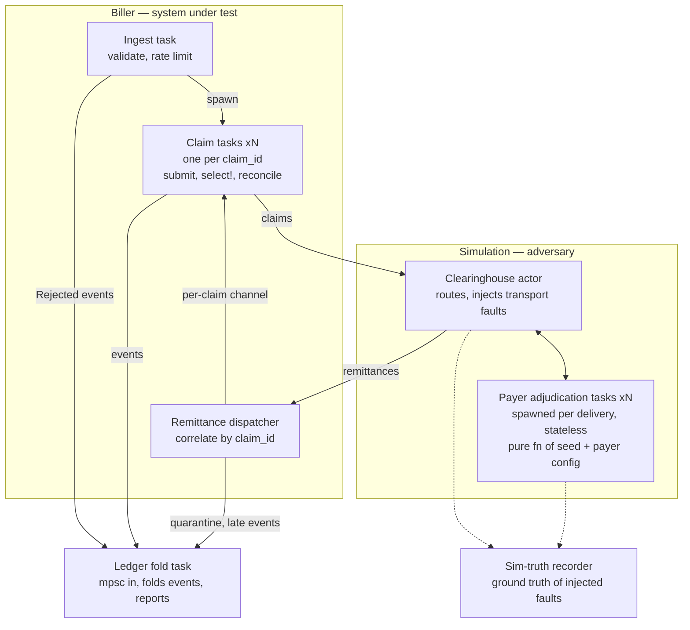

# Design: Healthcare Billing Lifecycle Simulation

Brace Health take-home. This document is the converged high-level design; it predates
all implementation. Treat it as the spec. Deviations are allowed but must be recorded
in the Decisions section with a rationale.

## Design philosophy

Work backwards from company value: the clearinghouse + payer layer is a **deliberately
unreliable, seedable adversary**, and the biller is the system under test. The fault
surface is the specification — "a correct biller" is defined as one where **every
ingested claim reaches a correct terminal state** (resolved, rejected, or flagged),
with no claim lost, stuck, or double-counted, under any seeded fault schedule.

Key asymmetry (intentional): the adversary side is **memoryless and reproducible**
(pure functions of seed + config); the biller side holds all the state (claim tasks,
routing map, ledger). The party being tested is the one that has to remember things.

## Architecture (v2 — final)



Components:

- **Ingest task**: reads input file at configured rate, validates each line
  (parse → schema → billable policy). Malformed claims enter the ledger as
  `Rejected` (terminal) — never silently dropped. Valid claims spawn a claim task
  into a `JoinSet`.
- **Claim tasks** (one per claim_id): own the claim's entire lifecycle as linear
  async code — submit, `select!` on reply-vs-virtual-timeout, bounded retry with
  backoff, reconcile, emit terminal event, return. Task completion == terminal state,
  which makes shutdown trivial: file exhausted + JoinSet drained ⇒ final reports ⇒ exit.
- **Clearinghouse actor**: the only long-lived simulation component. Routes claims
  by payer_id, injects transport faults (drop / duplicate / delay / corrupt) on
  BOTH directions, spawns a payer adjudication task per delivery.
- **Payer adjudication tasks**: stateless. Look up `PayerConfig[payer_id]`, derive
  RNG streams, virtual-sleep a latency draw from [min,max]_response_time_secs,
  adjudicate, respond. Re-delivery deterministically reproduces the identical
  remittance (idempotency via derivation, not storage).
- **Remittance dispatcher**: biller-side. Holds routing map `claim_id → sender`.
  Forwards matches to the owning claim task; unknown claim_ids → quarantine;
  remittances for deregistered (terminal) claims → late-remittance ledger event.
  This component exists so correlation-by-ID is a real, testable mechanism.
- **Ledger fold task**: single consumer of a lossless mpsc event channel
  (all biller components hold Sender clones). Folds `ClaimEvent`s into
  `HashMap<ClaimId, ClaimRecord>`; retains the raw event log. May re-publish to a
  broadcast tap for best-effort observers — the authoritative path is never broadcast
  (Tokio broadcast drops on lag; disqualifying for the system of record).
- **Sim-truth recorder**: ground truth of injected faults, kept strictly apart from
  the ledger. The ledger holds only what the biller could know from remittances.
  The gap between the two views is the biller's blind spot and the correctness oracle.

Dependency wall: `sim` and `biller` never depend on each other — only on shared
message/domain types. Simulation internals must never leak into the ledger.

## Virtual time

- All delays and timeouts are in virtual time via `tokio::time` under
  `tokio::time::pause()` + auto-advance: time jumps to the next armed timer only
  when all tasks are parked. Simulation runs as fast as compute allows.
- Timeouts are NOT messages. Silence is the failure. Each claim task races
  `select! { resp = rx.recv() => ..., _ = sleep(timeout) => ... }`.
- Latency is a payer/clearinghouse property; timeout is a biller policy; a
  "timeout fault" is emergent from their interaction, never injected directly.
- Determinism claim (exact wording matters): **outcome-deterministic** given a seed
  (same claims reach same terminal states with same money), NOT wall-clock- or
  attribution-deterministic.
- FIRST IMPLEMENTATION STEP: a ~50-line spike proving paused-time behavior —
  1,000 tasks with random virtual sleeps + a select!-with-timeout, assert
  millisecond wall-time completion and cross-run determinism. If the spike
  surprises, renegotiate the clock design before building anything on it.

## Determinism / RNG scheme

No shared RNG anywhere. Every random decision draws from a stream derived from the
master seed with a stable key. Two key families — do not mix them up:

- **Transport-fault decisions** (drop? duplicate? delay draw?): keyed by
  `hash(master_seed, claim_id, attempt, decision_point)`. Retries get fresh fates
  (otherwise a dropped claim is dropped forever and retries are pointless).
- **Adjudication content** (amounts, denial reasons, payer latency): keyed by
  `hash(master_seed, claim_id, decision_point)` — NO attempt component. Re-delivery
  must reproduce the identical remittance (this is what makes stateless payers sound).

## Ledger schema

Money is **integer cents** (`i64` or rust_decimal). Never floats. Reconciliation does
exact equality.

```rust
struct Ledger { claims: HashMap<ClaimId, ClaimRecord> }  // no secondary indexes; scans are fine at this scale

struct ClaimRecord {
    // identity (immutable after ingest)
    claim_id: ClaimId, payer_id: PayerId,
    provider_npi: String, organization_name: String, patient_member_id: String,
    // lifecycle
    state: ClaimState, attempts: u32,
    ingested_at: VirtualTime,
    first_submitted_at: Option<VirtualTime>,  // set once; retries never touch it
    resolved_at: Option<VirtualTime>,
    // money
    lines: Vec<LineRecord>,
    // audit / monitoring — append-only
    history: Vec<(VirtualTime, ClaimEvent)>,
}

enum ClaimState {
    Rejected { reason: ValidationError },          // terminal at ingest; still a ledger row
    AwaitingResponse { timeout_at: VirtualTime },  // state carries its own deadline
    Resolved,                                      // all lines adjudicated AND reconciled
    Flagged { reason: FlagReason },                // human-review queue; terminal
}
enum FlagReason { RetriesExhausted, ReconciliationFailed, MalformedRemittance }

struct LineRecord {
    service_line_id: String, procedure_code: String,
    units: u32, unit_charge_amount: Money,
    adjudication: Option<Adjudication>,   // None = unanswered; partial claims have a mix
}
struct Adjudication {
    payer_paid: Money, coinsurance: Money, copay: Money,
    deductible: Money, not_allowed: Money,
    denial_reason: Option<DenialReason>,
    adjudicated_at: VirtualTime,
}
```

Core invariant (the semantic-fault detector, per line):
`billed (= unit_charge x units) == payer_paid + coinsurance + copay + deductible + not_allowed`,
exact, in cents. Honest simulated payers must satisfy it by construction; dishonest
mode exists to violate it; the biller's reconciliation catches it → `Flagged`.

Design points already litigated — do not re-open casually:
- **No `Denied` state.** Denial is a line-level financial outcome. A fully-denied
  claim that sums correctly is `Resolved` (with denial_reasons); "denied" is a query,
  not a lifecycle branch. Lifecycle only asks: do I have a complete, consistent answer?
- **Aging keys off `first_submitted_at`**, never the latest retry.
- **Outstanding amounts are derived, never stored.** Ledger stores raw facts; every
  aggregate is a pure function of a snapshot.
- Ledger = biller's-knowledge view ONLY. Ground truth lives in sim-truth.

## Reports (all pure functions over ledger snapshot + now)

- AR aging by payer: non-terminal claims bucketed 0-30/31-60/61-90/90+ virtual days
  by `now - first_submitted_at`, summing payer-side outstanding. (Required core.)
- Payer vs patient responsibility split (falls out of Adjudication fields).
- Payer scorecard: avg response time, denial rate, paid/billed ratio per payer —
  should REDISCOVER the injected per-payer config differences from remittance data
  alone (closed-loop validation demo).
- Days in A/R headline: total outstanding / (total billed / elapsed virtual days).
- Denial breakdown by (payer, reason).
- Chase list: non-terminal claims sorted by (outstanding desc, age desc).
- Patient AR ages from `adjudicated_at` (when it became patient debt), not submission.
- Sim-truth diagnostic view (god's-eye): e.g. "biller believes N claims are slow;
  K were actually dropped." Doubles as the correctness oracle in tests.

## Fault table (spec + test matrix + commit burn-down list)

Class 1 — Ingest (input file):
| # | Fault | Mechanism | Ledger consequence |
|---|-------|-----------|--------------------|
| 1.1 | Invalid JSON line | ingest validation | Rejected(ParseError) |
| 1.2 | Schema violation (missing field, bad NPI, unknown payer_id, negative charge) | ingest validation | Rejected(SchemaError) w/ violation |
| 1.3 | Duplicate claim_id in file | ingest-side dedup | history event on existing record; not re-submitted |
| 1.4 | Schema-valid but odd (zero-dollar, all do_not_bill) | billable-policy layer | documented policy, e.g. all-do_not_bill => Resolved trivially |

Class 2 — Transport (clearinghouse):
| # | Fault | Mechanism | Ledger consequence |
|---|-------|-----------|--------------------|
| 2.1 | Claim dropped (either hop, silence) | timeout + bounded retry w/ backoff | AwaitingResponse; attempts++; first_submitted_at untouched |
| 2.2 | Remittance dropped (payer DID adjudicate) | same — indistinguishable from 2.1 | retry => payer re-delivers deterministic remit; biller dedups |
| 2.3 | Delay > biller timeout | emergent timeout; late arrival handled by dedup + late-arrival policy | possible retry + original both arrive; dedup; Flagged->Resolved allowed |
| 2.4 | Duplicate delivery | remittance dedup (biller); payer re-derives identical remit | at most one adjudication applied; dup logged in history |
| 2.5 | Reordering | none — correlation by claim_id, never arrival order | none; test asserts correctness under scrambled order |
| 2.6 | Drops exhaust retry budget | bounded retry => give up | Flagged(RetriesExhausted) |

Class 3 — Semantic (payer content):
| # | Fault | Mechanism | Ledger consequence |
|---|-------|-----------|--------------------|
| 3.1 | Amounts don't sum | reconciliation equation | Flagged(ReconciliationFailed{billed,accounted}) |
| 3.2 | Remit references unknown claim_id | dispatcher correlation | quarantine; never attaches |
| 3.3 | Missing / unknown service lines | line-level correlation | unknown lines => Flagged; missing lines => stays partially adjudicated, keeps aging |
| 3.4 | Full denial, sums correctly | none — NOT an error | Resolved with denial_reasons; appears in denial report only |
| 3.5 | Malformed remittance | response validation; treat as silence | timeout machinery owns it; "garbage received" history if correlatable, else quarantine |

Class 4 — reclassified as **architectural invariants**, not faults:
- No claim lost under burst ingest (bounded channels/backpressure).
- A slow payer cannot delay other payers' claims — true by construction in
  task-per-claim (no shared queue => no head-of-line blocking). Keep one test:
  anthem 100x slower, medicare latency unaffected.

## Decisions log (carry into README)

1. **Stateless payers; no duplicate-claim denials.** Real payers reject resubmissions
   (CARC 18) rather than re-adjudicating. Deliberately NOT modeled: honest dup-denial
   creates claims unresolvable without a claim-status-inquiry protocol (EDI 276/277) —
   a second transaction type, out of scope. Biller-side idempotency is fully exercised
   either way. (A seen-set version was designed and rejected as unjustified complexity;
   status inquiry is the named natural extension if interviewers add requirements.)
2. **Integer cents.** Reconciliation is exact equality; floats disqualifying.
3. **Outcome-determinism, not attribution/wall-clock determinism** — claim exact wording.
4. **No Denied lifecycle state** (see ledger section).
5. **Duplicate remittance for resolved claim**: ignore + history event (logged idempotency).
6. **Late remittance after Flagged(RetriesExhausted)**: allow Flagged -> Resolved; record transition.
7. **Unknown-claim remittances**: quarantine list on ledger.
8. **Corrupt/unparseable response == silence** epistemically; timeout owns it. One less code path.
9. **do_not_bill lines**: recorded in ledger, excluded from submission and money aggregates.
10. **Channels over shared locks** everywhere; ledger is single-consumer mpsc fold.
    Fold-as-you-go with retained event log (live stats + replayable audit).
11. Scope cuts, named: clearinghouse misrouting to wrong payer; payer crash as distinct
    from infinite latency (indistinguishable in-process — collapsed into 2.1).
12. **Virtual-time spike findings (build step 1).** (a) `start_paused(true)` requires
    tokio's `test-util` feature (a main dependency here, not dev-only — the binary
    itself runs paused) and a **current-thread runtime**: auto-advance does not exist
    on the multi-thread runtime. Consequence: the simulation is concurrent but
    single-threaded by construction; "use all cores" applies to CPU-bound work
    (report generation over snapshots), not the event loop. (b) A `select!` between
    two timers firing at the same virtual instant picks a branch at random —
    claim tasks must use `biased;` (response preferred over timeout) to keep the
    outcome-determinism claim honest. (c) Spike kept as `tests/virtual_time.rs`
    (permanent regression proof) rather than thrown away — deviation from "throwaway"
    wording, zero maintenance cost, guards the load-bearing assumption.
13. **Ledger schema deltas (build step 2).** (a) `ClaimState::Pending` added: ingest
    and first submission are distinct ledger events, so the record needs a state for
    the ms-scale gap between them. (b) Identity fields are `Option<ClaimIdentity>`:
    rejected rows from unparseable lines have no identity to record, and the design
    requires them to be ledger rows anyway. (c) `LineRecord` carries `do_not_bill`
    (needed to enforce Decision #9's exclusion from aggregates at report time).
    (d) Money is a `Money(i64)` newtype in cents (the design offered i64 or
    rust_decimal; zero-dependency exact integer math wins). Fractional-cent input
    amounts are schema violations, not rounding candidates.
14. **Late-remittance reconciliation lives in the fold** (build step 4, fault 2.3).
    A claim task is gone by definition when a late answer arrives, so the
    Flagged(RetriesExhausted) → Resolved transition (Decision #6) is applied by the
    ledger fold via a pure complete-and-balanced check over the record. Lifecycle
    logic stays in the biller; this is record surgery on an already-terminal row.
15. **Return-hop faults execute inside payer delivery tasks** (build step 4).
    Drops, delays, line drops, corruption and garbage on the payer → biller hop are
    drawn and applied in the per-delivery task the clearinghouse spawns. Keeps hop
    concurrency (a delayed remit blocks nothing) and preserves structural shutdown
    (the clearinghouse drains until every delivery task ends).
16. **The sim-truth diagnostic report imports sim-truth** (build step 5) — a
    deliberate exception to "reports depend only on ledger": the god's-eye view's
    entire purpose is comparing the two views. The protected invariant — sim-truth
    never leaking INTO the ledger — is untouched; no other report may touch sim.
17. **Payer-side outstanding is booked-or-not, per line** (build step 5): a line
    contributes zero to A/R once answered AND balanced; otherwise its full billed
    amount stays outstanding — including disputed (dishonest) answers, which a
    practice cannot book. Aging keys off first_submitted_at (payer A/R) and
    adjudicated_at (patient responsibility), per the report section.
18. **The CLI defaults to the 'messy' fault preset** (CLI polish phase). The
    assessment says to bake in a little unreliability, so a flag-free run shows
    drops, duplicates, and delays being survived rather than a sterile happy
    path. `--preset honest` restores lossless transport. The *library* default
    (`FaultProfile::default()`) stays all-zero: tests opt into faults explicitly.

## Module layout

```
src/
  domain/    claim, money, remittance, validation, message types (the only shared dep)
  sim/       clearinghouse, payer (pure fn + PayerConfig), faults, rng streams
  biller/    claim_task, dispatcher, retry policy
  ledger/    events, records, fold
  reports/   pure fns over ledger snapshot
  main.rs    config, wiring, shutdown
```
Rule: `sim` and `biller` may not import each other. `reports` depends only on `ledger`.
(Workspace crates would compiler-enforce this; modules + discipline chosen; note in README.)

## Build order

1. **Spike virtual time** (throwaway, see above). Gate: proven before anything else.
2. Skeleton: modules, domain types, channel message types, config structs.
3. **Vertical slice**: happy path end-to-end, zero faults — one claim: ingest ->
   submit -> honest adjudication -> remit -> reconcile -> Resolved -> trivial report ->
   graceful shutdown. Forces every channel/task/type to exist.
4. **One fault-table row per commit**: enable fault -> watch biller fail -> add
   mechanism -> add seeded regression test -> commit. Git history == fault table.
5. Reports, monitoring polish (tracing), README hardening, input generator for demos.