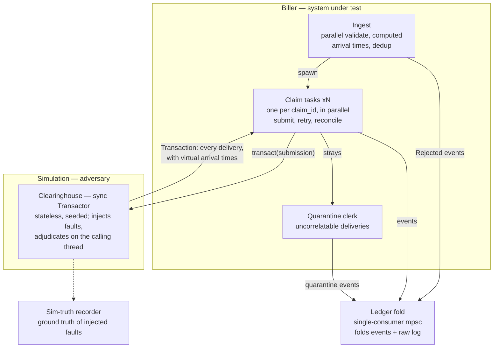

# Design: Healthcare Billing Lifecycle Simulation

Brace Health take-home. This is the converged design **as built** — read it as an
accurate map of the code. The path here (rejected alternatives, the paused-clock
era, the TUI's evolution) is recorded in [docs/RATIONALE.MD](docs/RATIONALE.MD).

## Design philosophy

Work backwards from company value: the clearinghouse + payer layer is a
**deliberately unreliable, seedable adversary**, and the biller is the system under
test. The fault surface is the specification — "a correct biller" is one where
**every ingested claim reaches a correct terminal state** (Resolved, Rejected, or
Flagged), with no claim lost, stuck, or double-counted, under any seeded fault
schedule.

Key asymmetry (intentional): the adversary side is **memoryless and reproducible**
(pure functions of seed + config); the biller side holds all the state. The party
being tested is the one that has to remember things.

## Architecture



- **Ingest** reads the input file, validates each line (parse → schema → billable
  policy), and computes each claim's virtual arrival time from the ingest rate.
  Malformed claims enter the ledger as `Rejected` (terminal) — never silently
  dropped. Valid claims spawn a claim task each.
- **Claim tasks** (one per claim_id) own the whole lifecycle as linear async code:
  submit, compare next-declared-arrival vs deadline, bounded retry with backoff,
  reconcile, emit terminal event, return. Task completion == terminal state, so
  **shutdown is structural**: input exhausted + tasks drained ⇒ channels close in
  dependency order ⇒ fold returns ⇒ reports print ⇒ exit. No shutdown signals.
- **Clearinghouse** is a stateless, seeded, synchronous `Transactor` (trait in
  `domain`, so `sim` and `biller` still never import each other). A call routes the
  claim by payer_id, draws transport faults for both hops, adjudicates via the pure
  payer function, and answers with a `Transaction`: **every delivery that attempt
  will ever produce**, stamped with computed virtual arrival times. An empty answer
  IS the drop faults — silence, unexplained.
- **Quarantine clerk**: deliveries whose claim_id matches no known claim (fault 3.2)
  become quarantine ledger events; they never attach to a record.
- **Ledger fold**: single consumer of a lossless mpsc event channel. Folds
  `ClaimEvent`s into records and retains the raw event log; `finalize` restores
  global order by (time, claim_id, arrival index) and rebuilds the intake-end
  snapshot as a per-claim replay.
- **Sim-truth recorder**: ground truth of injected faults, kept strictly apart from
  the ledger. The ledger holds only what the biller could know from remittances;
  the gap between the two views is the biller's blind spot and the correctness
  oracle in fault tests.

**Functional core, imperative shell**: every lifecycle decision is the pure
`machine::next(state, event, claim, policy, now) → (state, actions)`; adjudication
and reconciliation are pure functions. The async fns only move messages and do
arithmetic — nothing sleeps.

**Dependency wall**: `sim` and `biller` never depend on each other — only on shared
types in `domain`. Simulation internals must never leak into the ledger (one
audited exception: the diagnostic report, Decisions table).

## Virtual time

Time is **computed, not slept**: durations cross the biller ↔ sim boundary as
data. A submission declares when it was sent; the sim answers with every delivery
that attempt will ever produce, stamped with virtual arrival times. The claim task
keeps a local clock and compares its next declared arrival against its deadline —
a timeout is that comparison coming up empty, never a message.

- Silence is the failure: the biller is never told which hop dropped what.
- Latency is a payer property; the timeout is a biller policy; a "timeout fault"
  only ever *emerges* from their comparison.
- Because nothing sleeps, the sim runs on the stock multi-thread scheduler and
  claim tasks execute in true parallel (`--threads` sets the worker count). The
  finalized event log is identical across runs at any thread count, pinned by
  `tests/invariants.rs::full_event_log_is_identical_across_parallel_runs`.
- FENCE: this parallelism rests on claim independence and pre-seeded
  nondeterminism. Any future cross-claim coupling (payer rate limits, shared
  queues, load-dependent latency) breaks the declared-duration model.

## Determinism / RNG scheme

No shared RNG anywhere. Every random decision draws from a stream derived from the
master seed with a stable key. Two key families — do not mix them up:

- **Transport-fault decisions** (drop? duplicate? delay draw?): keyed by
  `hash(seed, claim_id, attempt, decision_point)`. Retries reroll their luck —
  otherwise a dropped claim is dropped forever and retries are pointless.
- **Adjudication content** (amounts, denial reasons, latency): keyed by
  `hash(seed, claim_id, decision_point)` — NO attempt component. Re-delivery
  reproduces the identical remittance: idempotency by derivation instead of payer
  state, which is what makes the payers safely stateless. Dishonest adjudication
  is keyed the same way, so duplicates of a lie are consistent too.

The determinism claim, worded precisely: **outcome-deterministic** given a seed
(same claims → same terminal states → same money) — NOT wall-clock- or
attribution-deterministic.

## Ledger schema

Money is **integer cents** (`Money(i64)`), never floats; fractional-cent inputs are
schema violations. Reconciliation is exact equality.

```rust
struct Ledger {
    claims: HashMap<ClaimId, ClaimRecord>, // no secondary indexes; scans are fine
    quarantine: Vec<StampedEvent>,         // remittances that matched no claim
    event_log: Vec<StampedEvent>,          // raw log, retained for replay/audit
}

struct ClaimRecord {
    claim_id: ClaimId,
    identity: Option<ClaimIdentity>,       // None only for unparseable rejects
    state: ClaimState, attempts: u32,
    ingested_at: VirtualTime,
    first_submitted_at: Option<VirtualTime>, // set once; retries never touch it
    resolved_at: Option<VirtualTime>,
    lines: Vec<LineRecord>,
    history: Vec<StampedEvent>,            // append-only audit trail
}

enum ClaimState {
    Pending,                                      // ingested, not yet submitted
    Rejected { reason: ValidationError },         // terminal at ingest; still a row
    AwaitingResponse { timeout_at: VirtualTime }, // state carries its own deadline
    Resolved,                                     // all lines adjudicated AND reconciled
    Flagged { reason: FlagReason },               // human-review queue; terminal
}
enum FlagReason { RetriesExhausted, ReconciliationFailed { billed, accounted }, MalformedRemittance }

struct LineRecord {
    service_line_id: String, procedure_code: String,
    units: u32, unit_charge: Money,
    do_not_bill: bool,                    // recorded; excluded from submission + aggregates
    adjudication: Option<Adjudication>,   // None = unanswered; partial claims have a mix
}
struct Adjudication {
    payer_paid: Money, coinsurance: Money, copay: Money,
    deductible: Money, not_allowed: Money,
    denial_reason: Option<DenialReason>,
    adjudicated_at: VirtualTime,
}
```

Core invariant (the semantic-fault detector, per line, exact, in cents):

```
billed (= unit_charge × units) == payer_paid + coinsurance + copay + deductible + not_allowed
```

Honest simulated payers satisfy it by construction; dishonest mode exists to
violate it; the biller's reconciliation catches it → `Flagged`.

## Reports (all pure functions over a ledger snapshot + now)

- **A/R aging by payer**: non-terminal claims bucketed 0-30/31-60/61-90/90+ virtual
  days by `now − first_submitted_at`. (Required core.)
- **Patient responsibility aging**: ages from `adjudicated_at` — when it became
  patient debt — not submission.
- **Days in A/R** headline: total outstanding / (total billed / elapsed days).
- **Payer scorecard**: avg response time, denial rate, paid/billed per payer,
  derived from remittance data alone — it should REDISCOVER the injected per-payer
  personalities (closed-loop validation demo).
- **Denial breakdown** by (payer, reason).
- **Chase list**: open claims by (outstanding, age), with risk = dollars × days.
- **Sim-truth diagnostic** (god's-eye): the biller's view next to what the
  adversary actually did. Doubles as the correctness oracle in tests.

The A/R views report over a **snapshot frozen when intake ends**: a real A/R
report is mid-flight by nature — on the final books every claim has been driven
terminal, which would empty the young buckets by construction. The summary and
diagnostic still assert the terminal guarantee on the final ledger; output labels
both moments. Outstanding amounts are derived, never stored: a line is booked once
answered *and* balanced; anything else — unanswered, in dispute — is open A/R at
full billed value.

## Fault table (spec + test matrix + commit burn-down list)

Class 1 — Ingest (input file):
| # | Fault | Mechanism | Ledger consequence |
|---|-------|-----------|--------------------|
| 1.1 | Invalid JSON line | ingest validation | Rejected(ParseError) |
| 1.2 | Schema violation (missing field, bad NPI, unknown payer_id, negative charge) | ingest validation | Rejected(SchemaError) w/ violation |
| 1.3 | Duplicate claim_id in file | ingest-side dedup | history event on existing record; not re-submitted |
| 1.4 | Schema-valid but odd (zero-dollar, all do_not_bill) | billable-policy layer | documented policy, e.g. all-do_not_bill ⇒ Resolved trivially |

Class 2 — Transport (clearinghouse):
| # | Fault | Mechanism | Ledger consequence |
|---|-------|-----------|--------------------|
| 2.1 | Claim dropped (either hop, silence) | timeout + bounded retry w/ backoff | AwaitingResponse; attempts++; first_submitted_at untouched |
| 2.2 | Remittance dropped (payer DID adjudicate) | same — indistinguishable from 2.1 | retry ⇒ payer re-delivers deterministic remit; biller dedups |
| 2.3 | Delay > biller timeout | emergent timeout; late-arrival policy | retry + original may both arrive; dedup; Flagged→Resolved allowed |
| 2.4 | Duplicate delivery | remittance dedup (biller); payer re-derives identical remit | at most one adjudication applied; dup logged in history |
| 2.5 | Reordering | none — correlation by claim_id, never arrival order | none; test asserts correctness under scrambled order |
| 2.6 | Drops exhaust retry budget | bounded retry ⇒ give up | Flagged(RetriesExhausted) |

Class 3 — Semantic (payer content):
| # | Fault | Mechanism | Ledger consequence |
|---|-------|-----------|--------------------|
| 3.1 | Amounts don't sum | reconciliation equation | Flagged(ReconciliationFailed{billed,accounted}) |
| 3.2 | Remit references unknown claim_id | quarantine clerk | quarantined; never attaches |
| 3.3 | Missing / unknown service lines | line-level correlation | unknown lines ⇒ Flagged; missing lines ⇒ stays partial, keeps aging |
| 3.4 | Full denial, sums correctly | none — NOT an error | Resolved with denial_reasons; appears in denial report only |
| 3.5 | Malformed remittance | response validation; garbage == silence | timeout machinery owns it; logged if correlatable, else quarantined |

Class 4 — reclassified as **architectural invariants**, not faults:
- No claim lost under burst ingest (bounded channels / backpressure).
- A slow payer cannot delay other payers' claims — true by construction in
  task-per-claim (no shared queue ⇒ no head-of-line blocking). One proving test:
  anthem 100× slower, medicare doesn't notice.

## Terminal experience

On a real terminal the run opens an interactive TUI (ratatui): four panes ordered
money-first (A/R Aging · Provider Insights · Timeline · Payer Scorecard) on a
numbered tab bar. Conventions, settled deliberately:

- **Layered navigation, three keys**: arrows move, Enter steps down a layer
  (provider → A/R analysis; aging report → timeline scrubber), Esc steps
  back up, the top layer being the pane bar. Ctrl-C is the only exit and prints
  the plain report on the way out, so a scrollback record always remains.
- **One moment per pane**: every number on a pane derives from the same snapshot.
  A/R Aging views the books as of one scrubbable virtual day (default: end of
  intake, the mid-flight view a biller lives in); Provider Insights reads the
  drained final books — what's still open at the end is exactly the human-review
  pile, digested into a per-provider plain-English analysis (aging concentration,
  status mix, payer signals, top chase items by risk = dollars × days, and
  recommended actions). Every figure is computed from the ledger; statuses keep
  the record's evidence ("retrying (attempt 3)", "flagged: doesn't sum
  (short $0.83)").
- **Hints live in the pane they describe**; the bottom status line never changes
  its text; `?` opens the full keyboard map.
- The simulation runs on a worker thread; the UI owns the main thread on the wall
  clock, meeting at a progress watch tap and a completion channel.

When stdout is not a terminal, or with `--no-tui`, output is the plain sequential
report — that path satisfies the assessment's "serialize to terminal, then shut
down" contract verbatim, and is the only surface for the god's-eye sim-truth
diagnostic.

## Decisions (litigated — don't re-open casually)

| Decision | Why |
|----------|-----|
| Stateless payers; no duplicate-claim denials | dup-denials make claims unresolvable without a status-inquiry protocol (EDI 276/277) — the named natural extension; biller idempotency is fully exercised anyway |
| Integer cents, exact equality | floats are disqualifying for reconciliation |
| Outcome-determinism only | wall-clock/attribution determinism is neither needed nor claimed |
| No `Denied` lifecycle state | denial is a line-level financial outcome; "denied" is a query — lifecycle only asks: complete, consistent answer? |
| Garbage response == silence | epistemically identical to a drop; the timeout machinery owns it — one less code path |
| Late remittance may resolve a Flagged claim | recorded Flagged→Resolved transition, applied by the fold (the claim task is gone by definition) |
| Duplicate remit for a resolved claim: ignore + log | idempotency must be visible in the audit trail |
| Outstanding derived, never stored | ledger stores raw facts; disputed answers stay open A/R at full billed value |
| Aging keys off `first_submitted_at` | retries must never make a stuck claim look fresh; patient A/R ages from `adjudicated_at` |
| A/R views read the intake-end snapshot | the drained final books would empty every young bucket by construction |
| Per-payer fault profiles | different clearinghouse routes fail differently — it's what gives each payer a distinct aging profile |
| Channels over shared locks; single-consumer fold | fold-as-you-go + retained event log: live stats and replayable audit, cheaply |
| `do_not_bill` lines recorded, excluded from money | policy enforced at report time, not by dropping data |
| CLI defaults to the `messy` preset | the assessment says to bake in unreliability; the *library* default stays zero-fault so tests opt in explicitly |
| Sim-truth read by exactly one report | the diagnostic's purpose is comparing the views; sim-truth never leaks INTO the ledger |
| Scope cuts, named | clearinghouse misrouting (mostly undetectable by the biller); payer crash as distinct from infinite latency (indistinguishable in-process — collapsed into drops); full defense in RATIONALE |

## Module layout

```
src/
  domain/    claim, money, remittance, validation, message types (the only shared dep)
  sim/       clearinghouse, payer (pure fn + PayerConfig), faults, rng streams
  biller/    claim_task, machine (pure state machine), reconcile, retry policy
  ledger/    events, records, fold
  reports/   pure fns over ledger snapshot
  tui/       interactive UI: mod (app/keys/overlays), theme, one module per pane
  main.rs    config, wiring, shutdown
```

Rule: `sim` and `biller` may not import each other; `reports` depends only on
`ledger`. (Workspace crates would compiler-enforce this; modules + discipline
chosen deliberately at this scale.)
